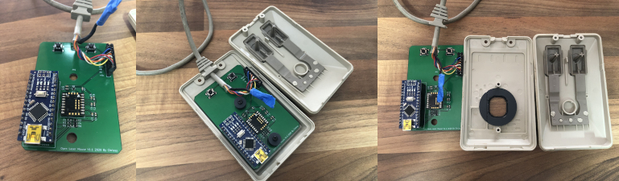

# Open Laser Mouse
 Quadrature Optical Mouse Replacement Using an Arduino for the Amiga Tank Mouse

Version 1.4.1
Copyright 2020 Chrissy

* Updated 3D Lens Cover

Version 1.4
Copyright 2020 Chrissy

* Added Atari ST SMD Version
  * Not Tested
  * Arduino is flipped 180° for ST version
  * Use same Amiga Pin definition in Arduino source if using original ST DE9 Connector.
* Fixed Wrong Fillplane selected. Corrected it back to GND.

Version 1.3
Copyright 2020 Chrissy

* ADNS9800 interface based on code from https://github.com/mrjohnk/ADNS-9800
* QUADRATURE interface based on blog from http://danceswithferrets.org/geekblog/?p=742

Two versions of the PCB, a SMD version (v1.1 Tested, not v1.3 yet) and a THT version which is currently untested.

Requires an Arduino Nano and a ADNS9800 Laser, which you can get still get from Aliexpress. Make sure to also get the Lens.

[**SMD Interactive BOM**][IBOMSMD]

[**THT Interactive BOM**][IBOMTHT]

Gerbers have been created from the recommendations at JLCPCB.

(https://support.jlcpcb.com/article/102-kicad-515---generating-gerber-and-drill-files)

You may need to re-generate for your chosen PCB Manufacturer

---

## 3D Printable Lens Cover

3D Printable Lens Cover still requires testing, Sketchup model file is included to modify for tolerances of your printer.
 Only for Amiga SMD Version at the moment

***Print Settings***

* Layer Height : 1.5mm
* Print Speed : 25 mm/s
* Initial Layer Speed: 15mm
* Support: Yes
* Infill: 20%
* Line Width: 0.4mm
* Print Thin Walls: Yes
* Filter Out Tiny Gaps: Yes

3D printed on a Ender 3 using Cura

A fully printable Amiga Tank Mouse is available here

https://www.myminifactory.com/object/3d-print-amiga-tank-mouse-all-parts-are-ultra-detailed-100-size-104702

Although looks tough to print :)

---

## !!!!! WARNING !!!!!
Don't Plug in the USB to the Arduino while connected to the Amiga/Computer, as this will join the 5V together and may damage something.

This is still a work in progress, use at your own risk. I accept no responsibility if this damages any of your equipment.

[IBOMSMD]: http://htmlpreview.github.io/?https://raw.githubusercontent.com/chris-jh/OpenLaserMouse/master/PCB/SMD/bom/ibom.html
[IBOMTHT]: http://htmlpreview.github.io/?https://raw.githubusercontent.com/chris-jh/OpenLaserMouse/master/PCB/THT/bom/ibom.html
